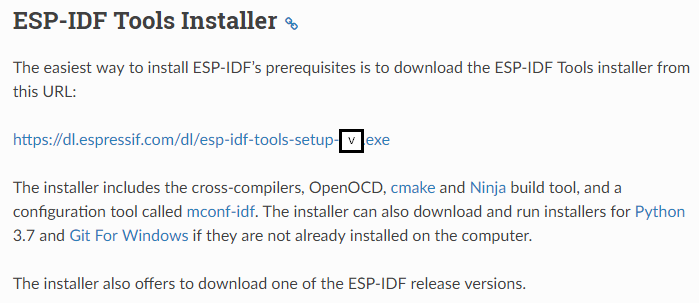
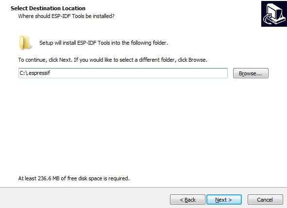
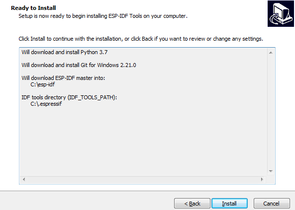

# **ESP-IDF installation (Windows & CMake)**

[Versión en español](https://github.com/mr-verdant-13/esp-idf-instructions/blob/master/ESP-IDF%20installation/CMake/V1.0.0WinES.md)

## **1. ESP-IDF setup**

- **1.1.** Download the ESP-IDF tools installer from the [**ESP-IDF Tools Installer**](https://docs.espressif.com/projects/esp-idf/en/latest/get-started/windows-setup.html#esp-idf-tools-installer) section of the **ESP-IDF Programming Guide**:

    

- **1.2.** Execute the `esp-idf-tools-setup-`*`version`*`.exe` file.

- **1.3.** Read the license agreement shown, check the **"I accept the agreement"** option and then click on the **"Next >"** button.

    

- **1.4.** Select the Python version that you want to use and then click on the **"Next >"** button.

    

- **1.5.** Select the Git version that you want to use and then click on the **"Next >"** button.

    

- **1.6.** Select whether you want to download the ESP-IDF or if you might use an existing ESP-IDF folder and then click on the **"Next >"** button.

    

    **Note 1:** The ESP-IDF directory must be located in the `C:\` drive directly (`C:\esp-idf`).

    **Note 2:** For the moment, only the `master` branch is completely compatible with CMake, so it is recommended that you download that version.

    

- **1.7.** Define the `C:\.espressif` path as the destination of the ESP-IDF tools and then click on the **"Next >"** button.

    

- **1.8.** Check if the provided info is correct and then click on the **"Install"** button.

    

- **1.9.** Wait until the installation finishes and then click on the **"Finish"** button.

    

## **2. Uninstall the ESP-IDF**

The ESP-IDF and its tools must be removed by using the `Uninstall a program` section of the `Control Panel`.

# **Result:**

- The ESP-IDF tools are installed on the `C:\` drive.
- The `esp-idf` repository is cloned to the `C:\` route.
