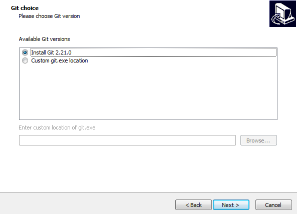

# **Instalación del ESP-IDF (Windows & CMake)**

[English version](https://github.com/mr-verdant-13/esp-idf-instructions/blob/master/ESP-IDF%20installation/CMake/V1.0.0WinEN.md)

## **1. Montaje del ESP-IDF**

- **1.1.** Descargar las herramientas de instalación del ESP-IDF desde la sección [**ESP-IDF Tools Installer**](https://docs.espressif.com/projects/esp-idf/en/latest/get-started/windows-setup.html#esp-idf-tools-installer) del **ESP-IDF Programming Guide**:

    

- **1.2.** Ejecutar el archivo `esp-idf-tools-setup-`*`versión`*`.exe`.

- **1.3.** Leer el acuerdo de licencia, habilitar la opción  **"I accept the agreement"** y luego cliquear en el botón **"Next >"**.

    

- **1.4.** Seleccionar la versión de Python que se desea usar y luego cliquear en el botón **"Next >"**.

    

- **1.5.** Seleccionar la versión de Git que se desea usar y luego cliquear en el botón **"Next >"**.

    

- **1.6.** Seleccionar si se desea descargar el ESP-IDF o si se usará una carpeta existente del ESP-IDF y luego cliquear en el botón **"Next >"**.

    

    **Nota 1:** La carpeta del ESP-IDF debe estar ubicada en el disco `C:\` directamente (`C:\esp-idf`).

    **Nota 2:** Por el momento, solo la rama `master` es completamente compatible con CMake, así que se recomienda descargar tal versión.

    

- **1.7.** Definir la ruta `C:\.espressif` como el destino de las herramientas del ESP-IDF y luego cliquear en el botón **"Next >"**.

    

- **1.8.** Revisar si la información presentada es correcta y luego cliquear en el botón **"Install"**.

    

- **1.9.** Esperar a que la instalación termine y luego cliquear en el botón **"Finish"**.

    

## **2. Desinstalar el ESP-IDF**

El ESP-IDF y sus herramientas deben ser eliminados utilizando la sección `Desintalar un programa` del `Panel de Control`.

# **Resultado:**

- Las herramientas del ESP-IDF son instaladas en el disco `C:\`.
- El repositorio `esp-idf` es clonado en la ruta `C:\`.
