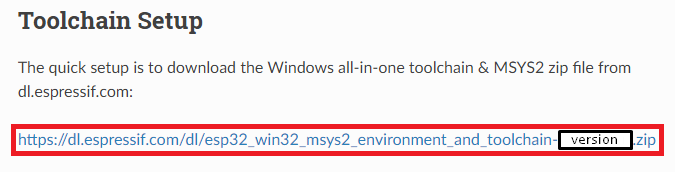

# **ESP-IDF installation (Windows & Makefile)**

[Versión en español](https://github.com/mr-verdant-13/esp-idf-instructions/blob/master/ESP-IDF%20installation/WinMakefileES.md)

## **1. Toolchain setup**

- **1.1.** Download the all-in-one toolchain from the [**Toolchain Setup**](https://docs.espressif.com/projects/esp-idf/en/latest/get-started-legacy/windows-setup.html#toolchain-setup) section of the **ESP-IDF Programming Guide**:

    

- **1.2.** Unzip the `msys32` folder, contained in the zip file, to `C:\`.

## **2. ESP-IDF setup**

- **2.1.** Right-click on [this link](https://raw.githubusercontent.com/mr-verdant-13/esp-idf-instructions/master/ESP-IDF%20installation/EspIdfSetup.bat) and then click on 'Save link as...' to save the `EspIdfSetup.bat` file.

- **2.2.** Execute the `EspIdfSetup.bat` file.

- **2.3.** Enter de info regarding the ESP-IDF version.

# **Result:**

- The toolchain is installed on the `C:\` drive.
- The `esp-idf` repository is cloned to the `C:\msys32\home` route.
- The `IDF_PATH` environment variable is defined as `C:/msys32/home/esp-idf`, which is consistent with the previous configuration steps.